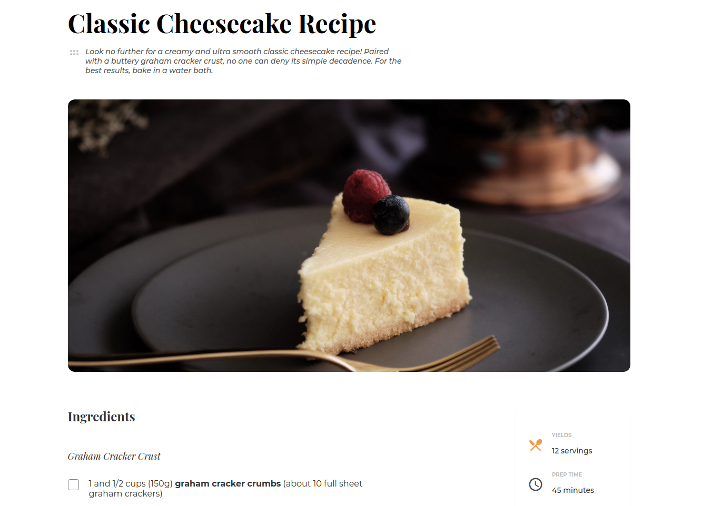

<h1 align="center">Recipe Page</h1>

   Solution for a challenge from  <a href="http://devchallenges.io" target="_blank">Devchallenges.io</a>.

  <h3>
    <a href="https://reliek21.github.io/recipe-page/">
      Demo
    </a>
     | 
    <a href="https://devchallenges.io/solutions/OcbBB62vL9kxZhWkyyaF">
      Solution
    </a>
     | 
    <a href="https://github.com/Kelex-21/recipe-page">
      Challenge
    </a>
  </h3>

## Table of Contents

- [Overview](#overview)
  - [Built With](#built-with)
- [Features](#features)
- [Contact](#contact)

## Overview

### Built With

- HTML
- CSS
- SCSS

## Features

This application/site was created as a submission to a [DevChallenges](https://devchallenges.io/challenges) challenge. The [challenge](https://devchallenges.io/challenges/hhmesazsqgKXrTkYkt0U) was to build an application to complete the given user stories.

## Contact

- GitHub [@reliek21](https://github.com/reliek21)
- Twitter [@reliek21](https://twitter.com/reliek21)
